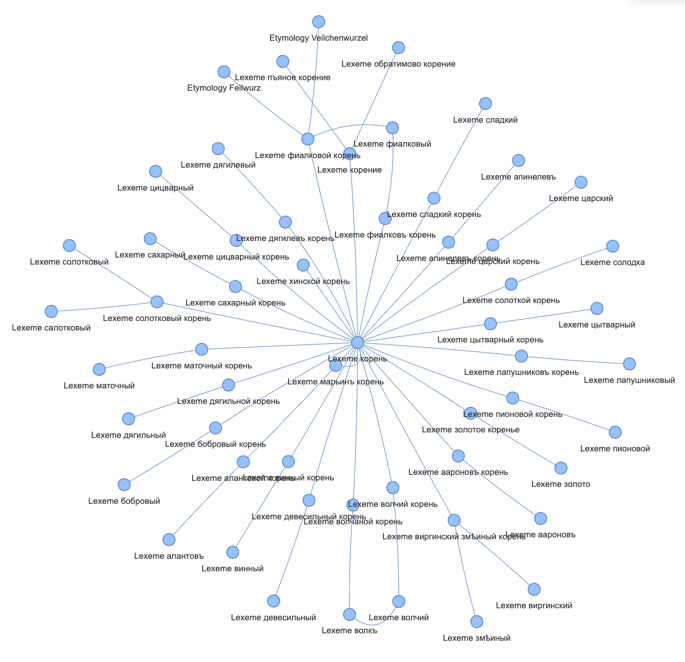

# lexeme-graph
## Выполнили
* Туретаева Амина
* Пановицына Анастасия Алексеевна
* Шарипов Сардор

## Как запустить проект?
* Нужно поэтапно запустить ячейки `jupyter notebook`
* На последней ячейке у пользователя будет запрашиваться
  * Лексема
  * и глубина просмотра
При правильном вводе образуется файл `graph.html`, где обрисовывается граф по `лексеме` которую ввели - находится все его связи до какой то глубины `deep`
  * Нужно открыть файл в браузере
